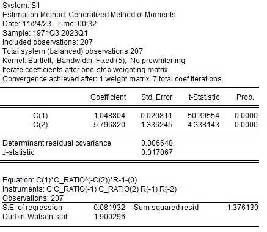

```{r include=FALSE}
library(readxl)
library(ggplot2)
library(lubridate)
library(forecast)
library(broom)
library(stargazer)
library(knitr)
library(urca)
library(tseries)
library(vars)
library(gmm)

library(dplyr)
library(tidyr)
library(readr)
```

# Importando dados

Inicialmente, vamos importar os dados gerados no Excel.

```{r}
dados_var_bruto <- read_xls(
  path = "./dados_lista3.xls",
  sheet = "Dados VAR"
  ) %>% 
  mutate(
    date = as_date(date)
  )
```

```{r}
dados_gmm <- read_xls(
  path = "./dados_lista3.xls",
  sheet = "Dados GMM"
  ) %>% 
  mutate(
    date = as_date(date)
  )
```

# Modelo VAR

## Tirar log diferenças

Nossas variáveis são Log Diferença do Consumo e Log dos Retornos. Criamos a variável log diferença dos retornos, mas ela não será utilizada nas estimações.

```{r}
dados_var <- dados_var_bruto %>%
  mutate(
    log_dif_c = log(c/lag(c)),
    log_dif_R = log_R - lag(log_R)
    ) %>% 
  filter(
    date > "1970-10-01"
  )
```

## Teste de Raíz Unitária

### Teste de Philips-Perron

Primeiro, para a série Log Diferença dos Retornos do T-Bill.

```{r, warning=FALSE}
pp.test(dados_var$log_R) %>% 
  tidy() %>% 
  kable(
    col.names = c(
      "Statistic: Dickey-Fuller Z (alpha)",
      "P Value",
      "Parameter: Truncation lag",
      "Method",
      "Alternative Hypothesis"
      ),
    caption = "Teste Philips Perron: Série Log Retornos"
    )
```

Portanto, verificamos que a log do retorno bruto é estacionária apenas ao nível de significância de 10%. Embora para isso seja necessário um intervalo expandido, menos restrito que a 5% ou 1%, a manutenção dessa variável é justificada pois estamos estimando um modelo estrutural, onde a unidade do dado é relevante.

Agora, para a Log-Diferença do Consumo.

```{r, warning=FALSE}
pp.test(dados_var$log_dif_c) %>% 
  tidy() %>% 
  kable(
    col.names = c(
      "Statistic: Dickey-Fuller Z (alpha)",
      "P Value",
      "Parameter: Truncation lag",
      "Method",
      "Alternative Hypothesis"
      ),
    caption = "Teste Philips Perron: Série Log Dif do Consumo"
    )
```

Verificamos que a log-diferença do consumo é estacionária.

### Augmented Dickey-Fuller

```{r, warning=FALSE}
adf.test(dados_var$log_R) %>% 
  tidy() %>% 
  kable(
    col.names = c(
      "Statistic: Dickey-Fuller Z (alpha)",
      "P Value",
      "Parameter: Truncation lag",
      "Method",
      "Alternative Hypothesis"
      ),
    caption = "Teste Augmented Dickey-Fuller: Série Log do Retorno"
    )
```

Portanto, verificamos que o log do retorno bruto é estacionário ao nível de significância de 5%.

```{r, warning=FALSE}
adf.test(dados_var$log_dif_c) %>% 
  tidy() %>% 
  kable(
    col.names = c(
      "Statistic: Dickey-Fuller Z (alpha)",
      "P Value",
      "Parameter: Truncation lag",
      "Method",
      "Alternative Hypothesis"
      ),
    caption = "Teste Augmented Dickey-Fuller: Série Log Dif do Consumo"
    )
```

Portanto, verificamos que a log-diferença do consumo é estacionária ao nível de significância de 1%.

## Funções de Autocorrelação

### FAC

```{r}
acf(dados_var$log_dif_c)
```

```{r}
acf(dados_var$log_R)
```

Indica um componente MA Inifinito, de decaimento lento no Log Retorno. Isso não necessariamente é um problema, pois devemos analisar a FACP.

### FACP

```{r}
pacf(dados_var$log_dif_c)
```

Indica um truncamento no lag 3 para essa variável.

```{r}
pacf(dados_var$log_R)
```

Aqui, aparente haver um alto grau de autocorrelação no primeiro lag, com truncamento a seguir. Os lags até 4 parecem ser relevantes também. Contudo, em geral as funções de autocorrelação, para ambas as séries, não mostram um padrão muito claro para apontarmos qual modelo seria mais apropriado. Utilizaremos a análise de critérios de informação.

## Critérios de Informação

Utilizamos a função VARselect que retorna a ordem que minimiza os critérios de informação.

```{r, warning=FALSE}
VARselect(
  y = dados_var[,c(4,3)],
  lag.max = 5,
  type = "const"
)$selection %>%
  tidy() %>% 
  kable(
    col.names = c(
      "Criteria",
      "Order"
    )
  )
  
```

Os critérios AIC e FPE sugerem ordem 4, mas os critérios BIC (SC) e HQ sugerem ordem 1. Pelas FACP acreditamos que a ordem 1 faça mais sentido nesse caso, mas faremos os dois casos.

## Modelagem VAR

```{r}
var1 <- VAR(
  y = dados_var[,c(4,3)],
  p = 1,
  type = "const"
)
```

```{r}
var4 <- VAR(
  y = dados_var[,c(4,3)],
  p = 4,
  type = "const"
)
```

```{r}
m1 <- var1$varresult
m4 <- var4$varresult
```

### VAR (1)

```{r, results='asis'}
stargazer(
  m1,
  column.labels = c("Consumo", "Retornos"),
  header = FALSE,
  float = FALSE
  )
```

Os resultados do modelo VAR indicam que mudanças passadas no consumo e no retorno têm um efeito positivo no consumo atual, sugerindo uma inércia no comportamento do consumo. Similarmente, variações anteriores nos retornos e no consumo estão positivamente relacionadas aos retornos atuais. As constantes revelam que, mesmo na ausência de mudanças nas variáveis explicativas, há um componente constante positivo contribuindo para o consumo, enquanto os retornos têm um componente constante negativo. Embora o modelo explique apenas uma parcela modesta da variação total, a estatística F sugere sua relevância global, enfatizando a influência significativa de fatores passados e constantes na dinâmica entre Consumo e Retornos.

### VAR (4)

```{r, results='asis'}
stargazer(
  m4,
  column.labels = c("Consumo", "Retornos"),
  header = FALSE,
  float = FALSE
  )
```

No que diz respeito ao consumo, a mudança passada em seu log (log_dif_c.l1) exerce um efeito positivo, embora mais moderado em comparação com o primeiro modelo. As defasagens adicionais (log_dif_c.l2 e log_dif_c.l3) ganham destaque, com coeficientes mais substanciais, indicando uma relevância crescente dessas defasagens na explicação do consumo atual. Isso está em linha com as autocorrelações calculadas anteriormente, que apresentam valores significantes para lags maiores que 1 no consumo, mas não para lag 1.

Em relação aos retornos, observa-se uma mudança significativa. O retorno passado (log_R.l1) agora apresenta um efeito positivo, enquanto vemos um impacto negativo na segunda defasagem (log_R.l2) que se torna positivo para a terceira defasagem (log_R.l3), sugerindo uma dinâmica temporal mais complexa.

Além disso, vale notar que os coeficientes estatísticamente significantes do modelo para o consumo são apenas os lags 2 e 3 da própria variável. Isso indica que o impacto intertemporal do juros no consumo é pequeno, sendo estatísticamente impossível de afirmar que ele não é zero.

Contudo, quando analisamos os retornos, vemos que além de todos os seus 4 lags serem estatísticamente significantes para explicar a dinâmica da variável, vemos que o consumo nos lags 1 e 3 também é estatísticamente significante. Isso mostra que, embora o efeito do juros no consumo não seja significativo, há um efeito do consumo no juros bastante relevante e estatísticamente diferente de 0. Veremos isso mais a fundo com as funções de resposta a impulso.

As estatísticas F indicam a validade global do modelo, destacando a relevância conjunta dessas variáveis explicativas. Apesar do aumento nas defasagens, o modelo continua a explicar uma parte modesta da variação, conforme refletido nos valores de R-quadrado ajustado. Em resumo, o segundo modelo VAR destaca nuances temporais distintas nas relações entre consumo e retornos, enfatizando a importância das diferentes defasagens na análise. Vemos que esse é um modelo melhor, mas devemos ainda olhar para os resíduos.

## Análise de Resíduos

### VAR (1)

```{r}
r1 <- residuals(var1) %>% as_tibble()
```

```{r}
acf(r1[,1])
```

```{r}
acf(r1[,1])
```

Os gráficos de autocorrelação e autocorrelação parcial nos indicam que não deve haver autocorrelação significativa dos resíduos, mas vamos fazer um teste de Ljung-Box, cuja hipótese nula é que os dados são independentemente distribuídos.

```{r}
Box.test(m1[["log_dif_c"]][["residuals"]], type = "Ljung-Box")
```

```{r}
Box.test(m1[["log_R"]][["residuals"]], type = "Ljung-Box")
```

Em nenhum dos dois testes rejeitamos a hipótese nula, logo não temos evidência estatística para afirmar que existe autocorrelação dos resíduos. Contudo o p-valor para o teste na avriável de log-retorno foi relativamente baixo. Podemos ver que há incidência de autocorrelações estatísticamente significativas nos resídos em alguns lags. É possível que obteríamos resultados melhores com mais lags. Veremos com 4 lags, que obtivemos pela minimização dos critérios de informação.

### VAR (4)

```{r}
r4 <- residuals(var4) %>% as_tibble()
```

```{r}
acf(r4[,1])
```

```{r}
acf(r4[,2])
```

Resultados bem melhores dessa vez. Novamente, vamos fazer um teste de Ljung-Box para avaliar se existe de autocorrelação significativa nos resíduos do modelo.

```{r}
Box.test(m4[["log_dif_c"]][["residuals"]], type = "Ljung-Box")
```

```{r}
Box.test(m4[["log_R"]][["residuals"]], type = "Ljung-Box")
```

O resultado dos testes de Ljung-Box para o modelo de ordem quatro também mostram que não há evidência de autocorrelação dos resíduos, dessa vez com p--valores muito mais altos. Podemos considerar que o VAR(4) é mais robusto que o VAR(1) para nosso modelo. Continuaremos, assim com esse modelo.

## Matriz de resposta aos choques

A tabela de resposta aos choques mostra como as variações percentuais nas variáveis de log (consumo e retornos) mudam quando acontecem choques pequenos em uma dessas variáveis.

```{r, results='asis'}
s4 <- summary(var4)

stargazer(
  s4$covres,
  header = FALSE,
  digits = 10
  )
```

## Função de Resposta a Impulso

### Geração das funções

```{r}
irf4_cc <- irf(
  var4,
  impulse = "log_dif_c",
  response = "log_dif_c",
  n.ahead = 24
  )

irf4_cR <- irf(
  var4,
  impulse = "log_dif_c",
  response = "log_R",
  n.ahead = 24
  )

irf4_RR <- irf(
  var4,
  impulse = "log_R",
  response = "log_R",
  n.ahead = 24
  )

irf4_Rc <- irf(
  var4,
  impulse = "log_R",
  response = "log_dif_c",
  n.ahead = 24
  )
```

### Impulso do Consumo no Consumo

```{r}
plot(irf4_cc)
```

O gráfico mostra um aumento inicial de pouco mais que $1\%$, seguido por respostas decrescentes.

### Impulso do Consumo no Retorno

```{r}
plot(irf4_cR)
```

A primeira linha indica uma resposta inicial crescente, atingindo um máximo por volta de 6 períodos a frente, em aproximadamente $0.002$. A partir desse máximo o efeito passa a decair lentamente. Isso indica que cada ponto percentual de aumento no consumo eleva a taxa de juros em aproximadamente $0.2\%$, que é um resultado estrutural bastante interessante do modelo.

### Impulso do Retorno no Retorno

```{r}
plot(irf4_RR)
```

Percebemos um decaimento mais lento na resposta à impulso da taxa de juros, indicando um grau de persistência de choques nessa variável bastante mais acentuado que os choques no consumo, que se dissipam rapidamente.

### Impulso do Retorno no Consumo

```{r}
plot(irf4_Rc)
```

O intervalo de confiança grande não permite afirmar com certeza o sinal da resposta ao impulso de um choque de juros no consumo. Contudo, o resultado da estimação (na linha preta) indica uma poupança no período inicial, ou seja redução de consumo, seguida por aumento leve no consumo a partir de 3 ou 4 períodos. Isso é condizente com a teoria econômica subjacente, já que choques no retorno levariam a poupança maior (inicialmente) e elevação do consumo após a extração dos ganhos do choque inicial.

## Coeficiente de Aversão Absoluta ao Risco

O coeficiente de aversão absoluta ao risco é calculado como a razão entre a covariância entre as variações no consumo (C) e nos retornos (R) e a variância das variações nos retornos. Essa medida fornece uma indicação de como as mudanças no consumo reagem em termos proporcionais às mudanças nos retornos, representando a aversão ao risco do agente econômico.

$\frac{\text{Cov}(C,R)}{\text{Cov}(R,R)}$

Agora, aplicamos a fórmula para obter o coeficiente de aversão absoluta ao risco.

```{r}
s4$covres[1,2]/s4$covres[2,2]
```

O coeficiente de aversão absoluto ao risco resulta em $-0.0992$, indicando uma relação negativa entre as mudanças no consumo e nos retornos, o que sugere uma aversão ao risco por parte do agente econômico. Entretanto, a magnitude do coeficiente indica que essa aversão é relativamente fraca.

# Modelo GMM

Esse modelo foi executado pelo Eviews, os resultados obtidos estão dispostos na imagem abaixo.



A equação estimada impõe restrições específicas à forma funcional da relação entre as variáveis. A função de utilidade é modelada como $C(1) \cdot C_{RATIO}^{-C(2)} \cdot R -1 = 0$, onde C(1) representa a taxa de desconto intertemporal e C(2) denota o coeficiente de aversão ao risco. Essa formulação implica que a decisão de consumo é influenciada pela razão de consumo (C_RATIO) e pelos retornos (R), refletindo as interações dinâmicas entre essas variáveis. Além disso, os lags desempenham o papel de controlar a endogeneidade e melhorar a precisão das estimativas, permitindo que o modelo capture as relações dinâmicas ao longo do tempo. No caso específico deste modelo, os lags de C_RATIO e R, como C_RATIO(-1), C_RATIO(-2), R(-1), e R(-2), foram escolhidos como instrumentos para garantir a validade dos resultados. A escolha dos lags é orientada pela teoria econômica e pela necessidade de lidar adequadamente com possíveis correlações entre as variáveis e os resíduos do modelo.

O coeficiente $C(1)$, referente ao beta, é a taxa de desconto intertemporal do consumo. Ele é estimado em $1.04$ com um desvio padrão de $0.02$. Isso significa que uma unidade adicional de consumo futuro é descontada a uma taxa média de aproximadamente $1.04$. Como a expectativa teórica é um beta entre 0 e 1, é válido considerarmos que os consumidores valorizam o presente e futuro aproximadamente da mesma forma, descontando a taxa de aproximadamente $1$.

Já o coeficiente $C(2)$, que representa o gamma, é o coeficiente de aversão ao risco. Ele é estimado em $5.79$ com um desvio padrão de $1.33$. Esse valor reflete a sensibilidade da função de utilidade em relação ao risco. Um gamma maior indica uma maior aversão ao risco, sugerindo que os consumidores estão dispostos a abrir mão de uma quantidade significativa de retorno para evitar situações de alto risco.
